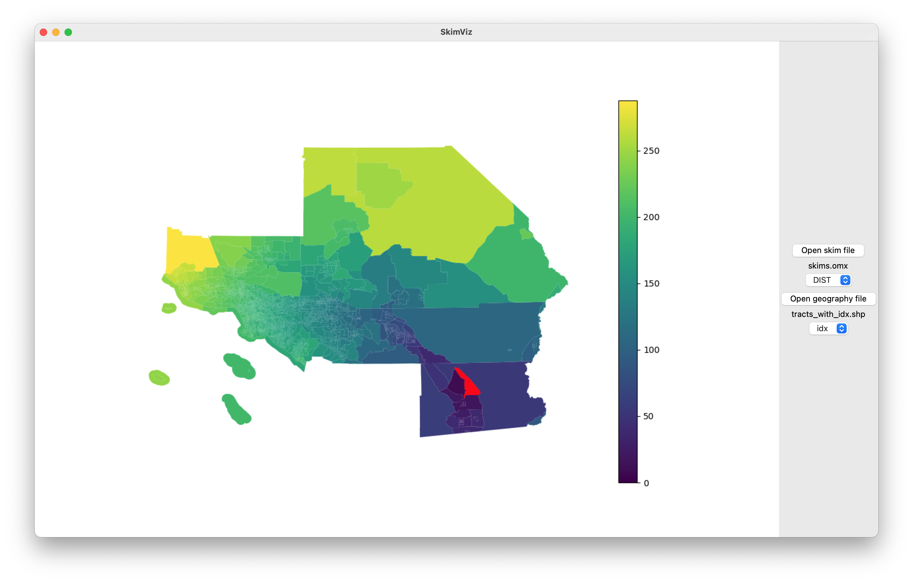

# SkimViz

This is Python/tkinter tool to visualize skim matrices stored in [OpenMatrix](https://github.com/osPlanning/omx) format.

## Usage

To start SkimViz, run `python skimviz.py`. You will need to have openmatrix, pandas, geopandas, matplotlib, and shapely installed. You will see a window where you can select your skim (`.omx`) file, as well as GIS file (in any format GeoPandas can read). The GIS file must have a column that contains the zero-based index of each TAZ in the skim matrix (mappings and 1-based TAZ numbering systems are not yet handled; the column in the GIS file must refer to the rows and columns in the skim arrays). Once a GIS file and a skim file have been loaded, you can select which skim you want to view from the OMX file, and which column in the GIS file refers to the rows and columns of the skim arrays.

Clicking on a TAZ in the graphical view will select it, and the map will re-render to show the values originating from that TAZ to all other TAZs.